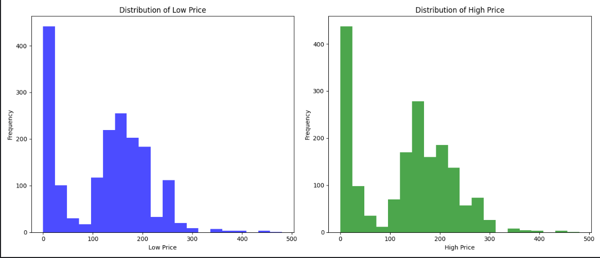
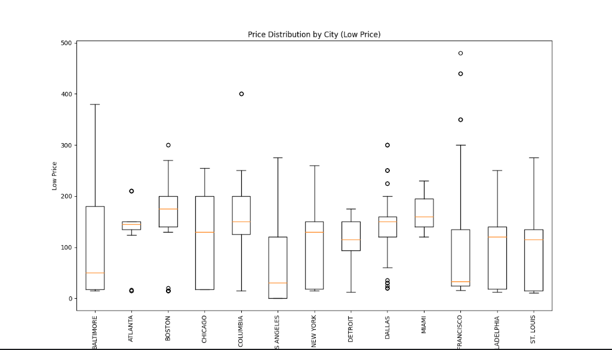
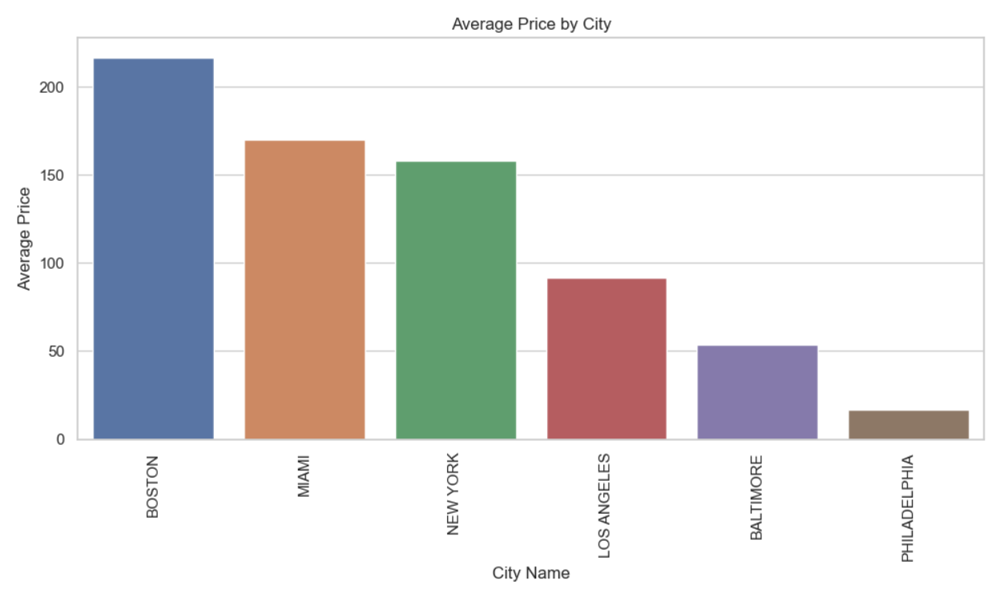
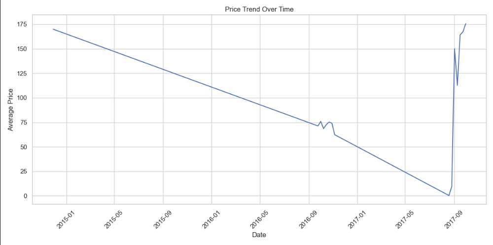

# matplotlib

- 频率峰值集中在 ​0-50​ 区间（近450次），随后缓慢下降。
在 ​100-150​ 和 ​200-250​ 区间出现两个小高峰，但整体趋势递减。
​400-500​ 区间频率接近零，说明低价商品极少超过400。
- 分布形态与低价商品高度相似，但峰值略向右偏移（如 ​200-250​ 区间出现更高峰）。
同样在 ​0-50​ 区间频率最高（近450次），但后续下降更平缓，​400-500​ 区间仍有少量分布。

- ​Baltimore​ 的中位数最低（橙色线位置最低），且箱体（四分位距）最宽，说明其低价商品价格范围广且整体偏低。
其他城市（如 ​New York、Los Angeles）中位数较高，箱体较窄，价格分布更集中。
- ​Baltimore、Atlanta、Columbia​ 的低价分布较分散，可能反映市场竞争激烈或消费水平差异。
​New York、San Francisco​ 等大城市的中位数较高，可能与生活成本或商品定位相关。
# seaborn

- 价格从高到低排序​：
​BOSTON（深蓝）​​ > ​MIAMI（橙）​​ > ​NEW YORK（绿）​​ > ​LOS ANGELES（红）​​ > ​BALTIMORE（紫）​​ > ​PHILADELPHIA（棕）​
- ​地域价格差异显著​：
东北部城市（BOSTON、NEW YORK）和佛罗里达州（MIAMI）的平均价格明显高于西部城市（LOS ANGELES、BALTIMORE、PHILADELPHIA）。
​BOSTON的价格几乎是PHILADELPHIA的10倍，可能与城市经济水平、消费能力或商品品类（如高端商品占比）相关。

- ​2015年1月—2017年6月​：
价格从约150持续下降至接近0，呈现长期低迷状态。
​2017年6月—2017年9月​：
价格急剧上升至接近175，短期内波动剧烈。
# 结论
- Matplotlib​

基础绘图库，支持折线图、柱状图等多种图表，通过pyplot接口可快速生成图表，自定义性强
。
​适用场景​：静态图表绘制，适合快速验证数据趋势。
- ​Seaborn​

基于Matplotlib封装，默认样式美观，支持热图、箱线图等统计图表，一行代码生成高质量可视化。
